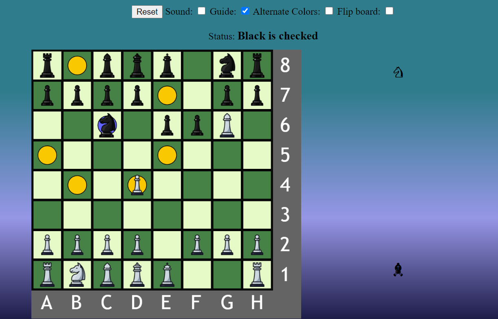

# Chess
My JS-version of chess

In this screenshot, we see multiple features of the game. 
The board itself follows a chess.com-like color scheme, but this can be changed to a traditional b/w board by ticking the box for alternate colors. 
In this image, it's blacks turn, and he has clicked the knight at C6. Because the "Guide"-checkbox is checked, the game displays all possible moves using this piece.
All chess moves, except the En Passant, is implemented in the game. This includes castling.
All captures pieces are also displayed on the right side of the board.

###This website uses assets like audio and images, and they may be blocked by your browsers CORS cross-origin policies. To circumvent this, spin up a simple web server like `php -S 0.0.0.0:8000` or `python3 -m http.server`
